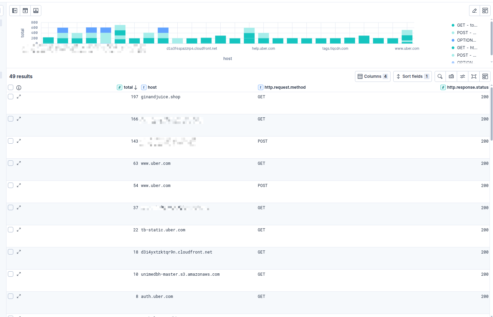
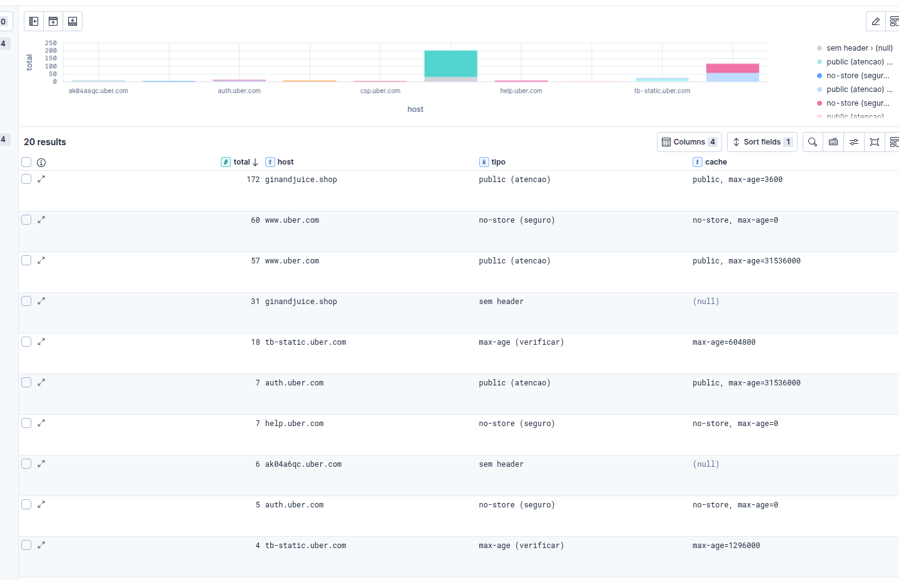

[English README](#about-elastico) | [README em Português](#sobre-o-elastico)

---

# About Elastico

Burp Suite extension to index HTTP traffic directly into Elasticsearch, enabling analysis and visualization in Kibana.

## How it works

The extension intercepts all traffic passing through Burp's Proxy and sends each request/response cycle as a JSON document to Elasticsearch.

The full flow:

1. **Interception:** Burp calls `processHttpMessage` on every HTTP response passing through the Proxy.
2. **Extraction:** Request and response data are extracted from `messageInfo` using Burp's API helpers.
3. **Serialization:** Data is assembled into a hierarchical JSON document with fields like host, method, URL, headers, and body.
4. **Queue:** The document is pushed into an internal queue (`Queue`) without blocking the Proxy.
5. **Indexing:** A worker thread consumes the queue in parallel and sends each document to Elasticsearch via HTTP POST.
6. **Visualization:** Documents are available in Kibana for queries, dashboards, and traffic analysis.

```
Burp Proxy --> processHttpMessage --> Queue --> worker thread --> Elasticsearch --> Kibana
```

You can build highly customized detection rules and analysis. Here are some simple examples:

### Attack surface overview

```sql
FROM burplogs*
| WHERE host NOT LIKE "*google*"
| STATS total = COUNT(*) BY host, http.request.method, http.response.status
| SORT host ASC, total DESC
```


### Cache control analysis

```sql
FROM burplogs*
| WHERE http.response.status == 200
| WHERE host NOT LIKE "*google*"
| EVAL cache = `http.response.headers.Cache-Control`
| EVAL tipo = CASE(
    cache IS NULL, "no header",
    cache LIKE "*no-store*", "no-store (safe)",
    cache LIKE "*no-cache*", "no-cache (safe)",
    cache LIKE "*private*", "private (safe)",
    cache LIKE "*public*", "public (attention)",
    cache LIKE "*max-age*", "max-age (review)",
    "other"
  )
| STATS total = COUNT(*) BY host, tipo, cache
| SORT host ASC, total DESC
```


## Requirements

- Burp Suite (Community or Pro)
- Jython Standalone JAR: https://www.jython.org/download
- Elasticsearch + Kibana (see Deploy section)

## Installation

1. In Burp, go to **Extensions > Options > Python Environment** and point to the Jython JAR.
2. Go to **Extensions > Add**, select type **Python** and load `elastico.py`.
3. The **Elastico** tab will appear in Burp with **Settings** and **Help** sub-tabs.

## Configuration

In the **Settings** tab, configure:

- **Host:** Elasticsearch address (default: `localhost`)
- **Port:** Elasticsearch port (default: `9200`)
- **Index:** Index name where documents will be stored (must be lowercase)

Click **Save** to apply. Subsequent requests will be indexed using the new configuration.

## Deploy ELK Stack

Recommended setup using Docker. Official docs:
https://www.elastic.co/docs/deploy-manage/deploy/self-managed/install-elasticsearch-docker-basic

For local lab use, run Elasticsearch with security disabled:

```bash
docker network create elastic

docker run --name es01 --net elastic -p 9200:9200 -m 4GB \
  -e "xpack.security.enabled=false" \
  -e "xpack.security.http.ssl.enabled=false" \
  -e "discovery.type=single-node" \
  -v elasticsearch-data:/usr/share/elasticsearch/data \
  -d docker.elastic.co/elasticsearch/elasticsearch:9.4.0

docker run --name kib01 --net elastic -p 5601:5601 \
  -e "ELASTICSEARCH_HOSTS=http://es01:9200" \
  -d docker.elastic.co/kibana/kibana:9.4.0
```

Access Kibana at `http://localhost:5601`.

## Document structure

```json
{
  "timestamp": "2026-05-07T00:00:00",
  "host": "example.com",
  "port": 443,
  "protocol": "https",
  "http": {
    "request": {
      "method": "POST",
      "url": "https://example.com/api/login",
      "length": 312,
      "headers": {
        "Content-Type": "application/json"
      },
      "body": "{...}"
    },
    "response": {
      "status": 200,
      "length": 1024,
      "headers": {
        "Content-Type": "application/json"
      },
      "body": "{...}"
    }
  }
}
```

## Verifying indexing

```bash
# Document count in the index
curl -s http://localhost:9200/<your-index>/_count

# Latest indexed documents
curl -s "http://localhost:9200/<your-index>/_search?size=3&sort=_id:desc"
```

## Built with

This extension was built from scratch with no prior Burp extension experience, using Claude as a learning assistant with a structured challenge-based approach.

## License

MIT

---

# Sobre o Elastico

[English README](#about-elastico) | [README em Português](#sobre-o-elastico)

Extensão do Burp Suite para indexar tráfego HTTP diretamente no Elasticsearch, permitindo análise e visualização no Kibana.

## Como funciona

A extensão intercepta todo o tráfego que passa pelo Proxy do Burp e envia cada ciclo request/response como um documento JSON para o Elasticsearch.

O fluxo completo:

1. **Interceptação:** o Burp chama `processHttpMessage` a cada resposta HTTP que passa pelo Proxy.
2. **Extração:** os dados da request e response são extraídos do `messageInfo` usando os helpers da API do Burp.
3. **Serialização:** os dados são montados em um documento JSON hierárquico com campos como host, método, URL, headers e body.
4. **Fila:** o documento é empurrado para uma fila interna (`Queue`) sem bloquear o Proxy.
5. **Indexação:** uma thread worker consome a fila em paralelo e envia cada documento para o Elasticsearch via HTTP POST.
6. **Visualização:** os documentos ficam disponíveis no Kibana para queries, dashboards e análise do tráfego capturado.

```
Burp Proxy --> processHttpMessage --> Queue --> worker thread --> Elasticsearch --> Kibana
```

Podemos fazer diversas coisas interessantes como criar regras de detecção extremamente customizadas. Veja alguns exemplos simples:

### Validando a superfície de ataque

```sql
FROM burplogs*
| WHERE host NOT LIKE "*google*"
| STATS total = COUNT(*) BY host, http.request.method, http.response.status
| SORT host ASC, total DESC
```


### Controle de cache

```sql
FROM burplogs*
| WHERE http.response.status == 200
| WHERE host NOT LIKE "*google*"
| EVAL cache = `http.response.headers.Cache-Control`
| EVAL tipo = CASE(
    cache IS NULL, "sem header",
    cache LIKE "*no-store*", "no-store (seguro)",
    cache LIKE "*no-cache*", "no-cache (seguro)",
    cache LIKE "*private*", "private (seguro)",
    cache LIKE "*public*", "public (atencao)",
    cache LIKE "*max-age*", "max-age (verificar)",
    "outro"
  )
| STATS total = COUNT(*) BY host, tipo, cache
| SORT host ASC, total DESC
```


## Requisitos

- Burp Suite (Community ou Pro)
- Jython Standalone JAR: https://www.jython.org/download
- Elasticsearch + Kibana (ver seção Deploy)

## Instalação

1. No Burp, vá em **Extensions > Options > Python Environment** e aponte para o JAR do Jython.
2. Vá em **Extensions > Add**, selecione o tipo **Python** e carregue o arquivo `elastico.py`.
3. A aba **Elastico** vai aparecer no Burp com as abas **Settings** e **Help**.

## Configuração

Na aba **Settings**, configure:

- **Host:** endereço do Elasticsearch (default: `localhost`)
- **Port:** porta do Elasticsearch (default: `9200`)
- **Index:** nome do índice onde os documentos serão armazenados (deve ser lowercase)

Clique em **Salvar** para aplicar. As próximas requests já serão indexadas com a nova configuração.

## Deploy do ELK

Recomenda-se subir o Elasticsearch e Kibana via Docker. Instruções oficiais:
https://www.elastic.co/docs/deploy-manage/deploy/self-managed/install-elasticsearch-docker-basic

Para uso em lab local, suba o Elasticsearch com segurança desabilitada:

```bash
docker network create elastic

docker run --name es01 --net elastic -p 9200:9200 -m 4GB \
  -e "xpack.security.enabled=false" \
  -e "xpack.security.http.ssl.enabled=false" \
  -e "discovery.type=single-node" \
  -v elasticsearch-data:/usr/share/elasticsearch/data \
  -d docker.elastic.co/elasticsearch/elasticsearch:9.4.0

docker run --name kib01 --net elastic -p 5601:5601 \
  -e "ELASTICSEARCH_HOSTS=http://es01:9200" \
  -d docker.elastic.co/kibana/kibana:9.4.0
```

Acesse o Kibana em `http://localhost:5601`.

## Estrutura do documento indexado

```json
{
  "timestamp": "2026-05-07T00:00:00",
  "host": "exemplo.com",
  "port": 443,
  "protocol": "https",
  "http": {
    "request": {
      "method": "POST",
      "url": "https://exemplo.com/api/login",
      "length": 312,
      "headers": {
        "Content-Type": "application/json"
      },
      "body": "{...}"
    },
    "response": {
      "status": 200,
      "length": 1024,
      "headers": {
        "Content-Type": "application/json"
      },
      "body": "{...}"
    }
  }
}
```

## Verificando a indexação

```bash
# Contagem de documentos no índice
curl -s http://localhost:9200/<seu-index>/_count

# Últimos documentos indexados
curl -s "http://localhost:9200/<seu-index>/_search?size=3&sort=_id:desc"
```

## Como foi construído

Esta extensão foi desenvolvida do zero, sem nenhuma experiência prévia com extensões do Burp, utilizando o Claude como assistente de aprendizado com uma abordagem estruturada de desafios progressivos.

O prompt utilizado:

```
Você é um líder de RedTeam especializado em desenvolvimento de ferramentas ofensivas e integração com SIEM.

Quero aprender a escrever uma extensão do Burp Suite em Python do zero, sem nunca ter feito isso antes.

Me ensine no formato de missões progressivas:
- Cada missão tem um objetivo claro e critério de sucesso
- Antes de cada missão, me aponte a documentação oficial para eu ler
- Não me dê a resposta de cara, me ajude a raciocinar
- Quando eu errar, aponte o problema sem resolver por mim
- Quando eu acertar, explique o que aconteceu antes de avançar

O objetivo final é uma extensão chamada Elastico que:
- Intercepta todo tráfego HTTP do Proxy do Burp
- Monta um documento JSON hierárquico com request, response, headers e body
- Envia para o Elasticsearch via fila assíncrona para não travar o Proxy
- Tem interface gráfica no Burp para configurar host, porta e índice
- Tem aba de Help com documentação em HTML

Stack: Jython (Python 2), API do Burp, Elasticsearch rodando em Docker sem TLS.
```

## Licença

MIT
